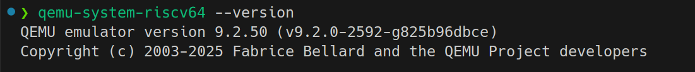
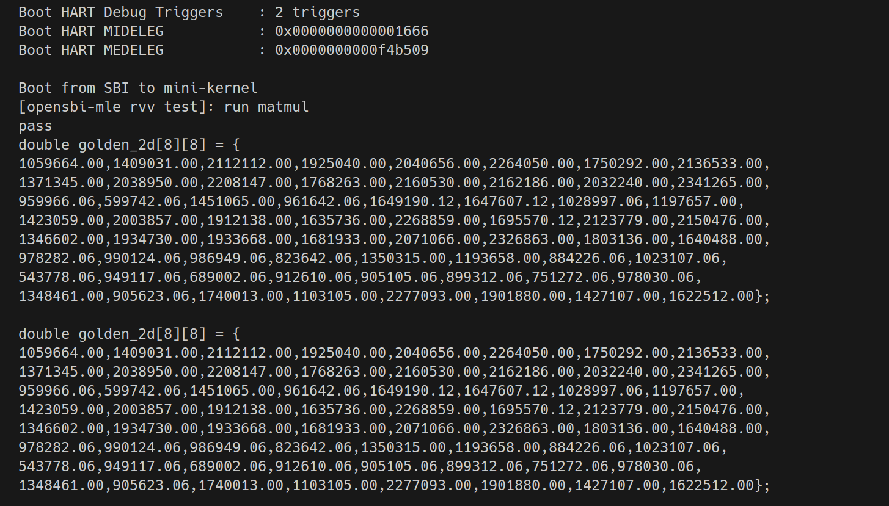

# opensbi-mle

OpenSBI是RISC-V SBI的开源实现

## 项目介绍

## 项目结构

项目根目录下:

- `abstract-machine`: 为运行在opensbi-mle之上的测试内核提供必要的支撑, 例如printf、malloc等基本libc调用.
- `am-kernels-test`: 基于abstract-machine的简单的应用以及测试应用.
- `assets`: 存放图片等.
- `doc`: 文档
- `mini-kernel-test`: 自构建的迷你内核, 运行在opensbi-mle之上, 包含rvv目录, 测试rvv.
- `opensbi`: 基于最新版 <https://github.com/riscv-software-src/opensbi.git> 实现的opensbi-mle版本.

## 环境配置

默认主机环境为Ubuntu22.04及以上, 虚拟机、WSL、实机均可.

### RISCV仿真环境

事实上, 有spike和qemu可选, 仿真效率qemu最高, 支持的拓展数spike最多. 本文教程选用qemu即可
这里有更多的安装信息<https://wiki.qemu.org/Hosts/Linux>

```BASH
# qemu依赖
sudo apt-get install git libglib2.0-dev libfdt-dev libpixman-1-dev zlib1g-dev ninja-build
```

```BASH
git clone https://github.com/qemu/qemu.git
cd qemu
git submodule update
sudo apt install libslirp-dev
./configure  --enable-slirp  --target-list=riscv64-softmmu,riscv64-linux-user
make -j`nproc` && make install
# 安装后运行
qemu-system-riscv64 --version
```



### 构建并运行本项目

```BASH
# 环境配置
export WORK_SPACE=${HOME}/opensbi-mle
export OPENSBI_HOME=$WORK_SPACE/opensbi
export AM_HOME=$WORK_SPACE/abstract-machine
export ISA=riscv64
# 编译参数
# qemu-system-riscv64路径
export PATH="/nfs/home/leguochun/local/bin:$PATH"
export LD_LIBRARY_PATH=/nfs/home/leguochun/local/bin:$LD_LIBRARY_PATH
# 编译器路径
export PATH="/nfs/home/leguochun/jupiter-linux/spacemit-toolchain-linux-glibc-x86_64-v1.0.5/bin:$PATH"
export CROSS_COMPILE=riscv64-unknown-linux-gnu-
# 测试运行
make demo
```

运行结果如图


#### 单独编译opensbi-mle

```BASH
# opensbi-mle环境
cd opensbi
make all PLATFORM=generic PLATFORM_RISCV_XLEN=64 PLATFORM_RISCV_ABI=lp64d PLATFORM_RISCV_ISA=rv64imafdcv_zicsr_zifencei_
```

#### 单独测试demo

```BASH
# demo sgemm, 还有matmul等
cd mini-kernel-test/rvv
make ARCH=riscv64-sbiqemu run TEST=sgemm
```
